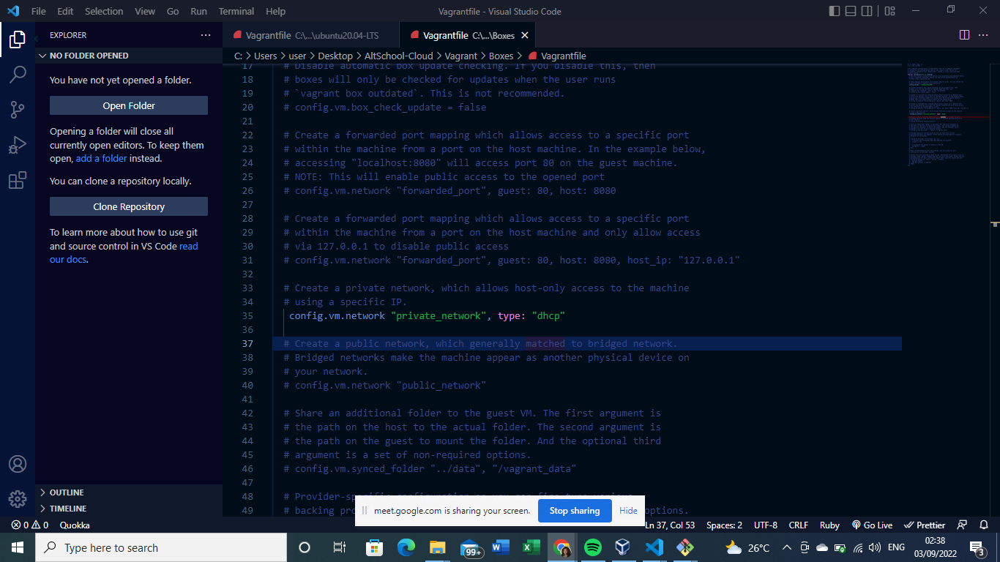
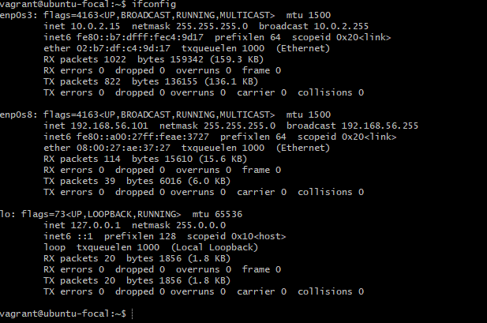

Customizing my vagrant file was a tedious and complicated task but i eventually crossed the hurdle.
The image below named "dhcp" is a snapshot of my vagrant file specifying where i customized the private network to dhcp.

Even after doing this i ran "ifconfig" severally and it gave an error message.
With the help of one of my circle members and several hours and codes later, below are some of the codes that helped other people but didn't work for me 

"VBoxManage dhcpserver remove --netname HostInterfaceNetworking-vboxnet0"

 "–BoxManage dhcpserver remove --netname HostInterfaceNetworking-vboxnet0"

" –––––VBoxManage hostonlyif create"

Eventually i added this to the top of my vagrant file and then it worked.
 "class VagrantPlugins::ProviderVirtualBox::Action::Network
  def dhcp_server_matches_config?(dhcp_server, config)
    true
  end
end"

The output of running ifconfig on my vagrant machine.

 

